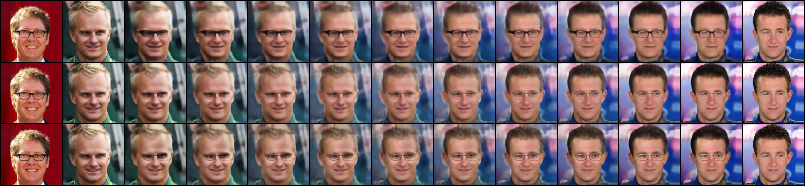
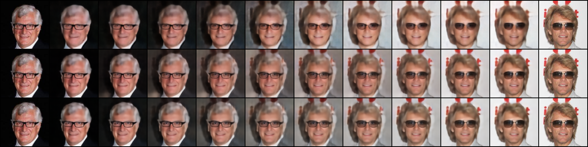
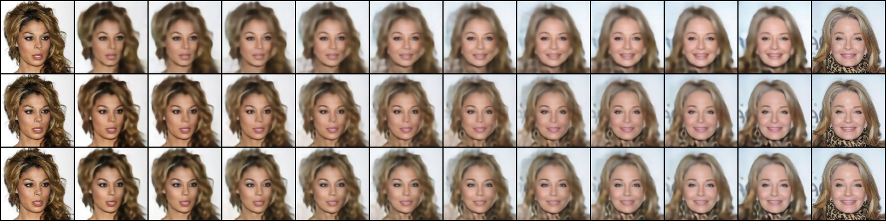
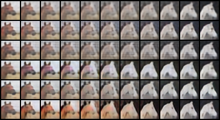
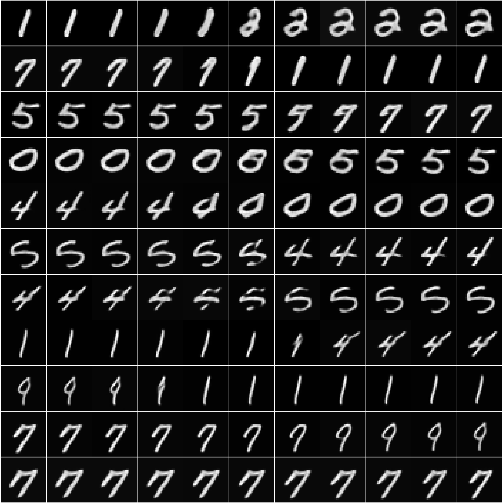
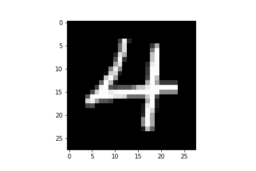
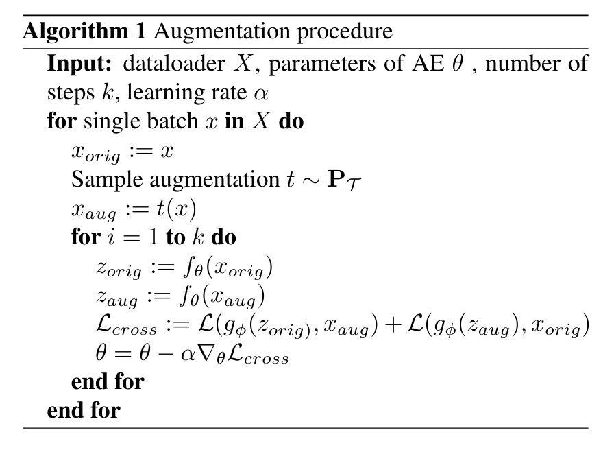

# non-variational-autoencoders

Authors: Grigorii Sotnikov, Vladimir Gogoryan, Dmitry Smorchkov, Ivan Vovk

## Unsupervised Domain Translation

### References
https://arxiv.org/pdf/2001.05017.pdf
https://github.com/oripress/ContentDisentanglement

### Reproducibility
Link to download aligned images in CelebA
https://drive.google.com/open?id=0B7EVK8r0v71pZjFTYXZWM3FlRnM

Link to download list_attr_celeba.txt
https://drive.google.com/drive/folders/0B7EVK8r0v71pOC0wOVZlQnFfaGs

Run a command:
python preprocess.py --root ./img_align_celeba --attributes ./list_attr_celeba.txt --dest ./glasses_train

After this command in directory /glasses_train will be located 4 files: trainA.txt, trainB.txt, testA.txt, testA.txt

Then by starting from Disentanglement.ipynb a mode can be trained from the config.yml

The other possible option is to use pretrained models which are located at https://drive.google.com/open?id=1sA6BXedG23_ZTuES_udeQlYXrssFq2BU
and proceed to visualization.ipynb where beautiful visualizations can be plotted via written functions

### Files description

    1) disentanglement.ipynb - train UDT model
    2) modules.py - parts of the model: E1, E2, Decoder, Disc
    3) utils.py - necessary functions for reproducible research
    4) preprocess.py - given folder img_align_celeba produces separate dataset partitioning
    5) visualization.ipynb - a notebook where you can plot beautiful interpolations between samples in different settings. Source of visualization for the project.

## Adversarially Constrained Autoencoder Interpolation

### References
https://arxiv.org/pdf/1807.07543.pdf

### Files description

    1) evaluation.py - fit a FC on top of trained latent representations
    2) modules.py - blocks of models
    3) train.py - fit ACAI and Baseline models with necessary losses
    4) utils.py - load datasets
    5) visualize.py - plot interpolated samples during training
    6) visualization.ipynb - obtain interpolations for report and score models via FC layer
    7) acai_train.ipynb - train baseline AE and ACAI from configs

## On the Transformation of Latent Space in Autoencoders

### References
https://arxiv.org/pdf/1901.08479.pdf

### Augmentation procedure
